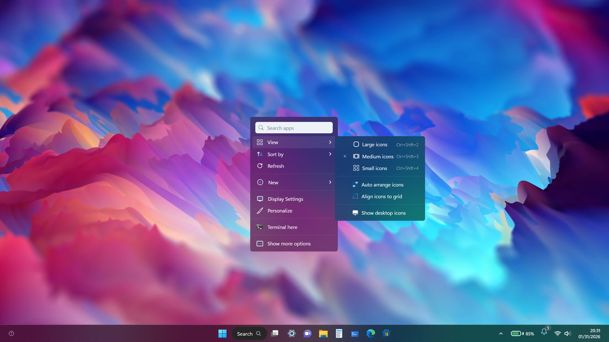

<!--
  ╔═══════════════════════════════════════════════════════════════════════════╗
  ║                                                                           ║
  ║        🪟 win11web - Windows 11 in your Browser                    ║
  ║                                                                           ║
  ╚═══════════════════════════════════════════════════════════════════════════╝
-->

<div align="center">



# 🪟 Windows 11 Web

### Experience Windows 11 directly in your browser!

[](https://nextjs.org/)
[](https://react.dev/)
[](https://www.typescriptlang.org/)
[](https://chakra-ui.com/)
[](LICENSE)
[](https://github.com/manojxshrestha/win11web/issues)

**Discover the elegance of Windows 11 in your browser!**

</div>

---

## ✨ Features

### 🖥️ Desktop Experience
- **Authentic Windows 11 UI** - Mica material, rounded corners, Acrylic blur effects
- **Draggable Icons** - Desktop icons with grid snapping
- **Multiple Wallpapers** - 8 beautiful Windows 11 wallpapers
- **Light/Dark Theme** - System-wide theme support
- **Taskbar** - Floating taskbar with pinned apps and system tray

### 🪟 Window Management
- **Minimize/Maximize/Close** - Full window control
- **Snap Layouts** - Windows 11 snap layouts (left, right, quadrants)
- **Drag & Resize** - Intuitive window manipulation
- **Z-Index Management** - Proper focus and layering

### 📱 Built-in Apps (21 Apps!)

| Category | Apps |
|----------|------|
| **Browsers** | Microsoft Edge, Google Chrome |
| **Productivity** | Notepad, Calculator, File Explorer |
| **Development** | Visual Studio Code, GitHub, Terminal, PowerShell, CMD |
| **Media** | Spotify, Photos |
| **Office** | Word, Excel, PowerPoint, Outlook |
| **System** | Settings, Recycle Bin, Microsoft Store |

### 🖥️ Terminal Emulation
- **Real PTY Sessions** - Using node-pty for authentic terminal
- **PowerShell & CMD** - Choose your preferred shell
- **Command History** - Navigate with up/down arrows
- **Tab Completion** - Intelligent path completion
- **Virtual Filesystem** - In-memory file operations

### 🔧 System Features
- **Start Menu** - Windows 11 style with search and pinned apps
- **System Tray** - Clock, notifications, quick settings
- **Recycle Bin** - Delete and restore files
- **Desktop Context Menu** - Right-click menu options
- **Settings Panel** - Personalization, display, system settings

---

## 🚀 Getting Started

### Prerequisites

| Requirement | Version |
|-------------|---------|
| Node.js | ≥ 18.x |
| pnpm | ≥ 8.x |
| npm | ≥ 9.x |

### Installation

```bash
# Clone the repository
git clone https://github.com/manojxshrestha/win11web.git
cd win11web

# Install dependencies
pnpm install

# Start development server
pnpm dev
```

### Running the Application

| Command | Description |
|---------|-------------|
| `pnpm dev` | Start Next.js development server |
| `pnpm build` | Build for production |
| `pnpm start` | Start production server |
| `pnpm lint` | Run ESLint |

Open [http://localhost:3000](http://localhost:3000) in your browser.

---

## 🏗️ Project Structure

```
win11web/
├── apps/
│   └── WindowsWeb/
│       ├── src/
│       │   ├── app/                 # Next.js App Router
│       │   │   ├── (windows)/       # Desktop routes
│       │   │   ├── layout.tsx       # Root layout
│       │   │   └── providers.tsx    # Context providers
│       │   ├── components/          # React components
│       │   │   ├── Apps/            # Application components
│       │   │   ├── DesktopIcon/     # Desktop icon system
│       │   │   ├── StartMenu/       # Start menu
│       │   │   ├── SystemTray/      # System tray
│       │   │   └── Taskbar/         # Taskbar
│       │   ├── contexts/            # React contexts
│       │   │   ├── Windows/         # Window management
│       │   │   ├── System/          # System settings
│       │   │   └── RecycleBin/      # Recycle bin state
│       │   ├── constants/           # App definitions
│       │   └── hooks/               # Custom React hooks
│       ├── public/                  # Static assets
│       │   ├── icons/               # App icons
│       │   ├── wallpapers/         # Desktop wallpapers
│       │   └── sounds/             # System sounds
│       └── server/                  # Backend server
│           └── src/
│               ├── index.ts          # Express + Socket.io
│               ├── terminal/        # Terminal emulation
│               └── filesystem/       # Virtual filesystem
├── packages/                        # Shared packages
└── README.md
```

---

## 🛠️ Tech Stack

### Frontend
- **Next.js 14** - React framework with App Router
- **React 18** - UI library
- **TypeScript 5** - Type safety
- **Chakra UI** - Component library
- **Framer Motion** - Animations
- **xterm.js** - Terminal emulator

### Backend
- **Node.js** - JavaScript runtime
- **Express** - Web framework
- **Socket.io** - Real-time communication
- **node-pty** - Terminal pseudoPTY

### Development
- **pnpm** - Package manager
- **Turbo** - Build orchestration
- **ESLint** - Code linting
- **Cypress** - E2E testing

---

## 🎨 Customization

### Adding New Apps

```typescript
// apps/WindowsWeb/src/components/Apps/apps.tsx
export const MyApp: App = {
  shortName: 'App',
  fullName: 'My Application',
  processName: 'myapp',
  icon: <Image src="/icons/myapp.png" alt="app" />,
  Window: MyAppComponent,  // Your React component
  initialSize: { width: 800, height: 600 },
};
```

### Adding Wallpapers

Place images in `apps/WindowsWeb/public/wallpapers/` and update the wallpaper array in the System context.

### Custom Terminal Commands

Add commands in `apps/WindowsWeb/server/src/terminal/commands/`

---

## 🤝 Contributing

Contributions are welcome! Please read our [contributing guidelines](CONTRIBUTING.md) first.

1. Fork the repository
2. Create your feature branch (`git checkout -b feature/amazing-feature`)
3. Commit your changes (`git commit -m 'Add amazing feature'`)
4. Push to the branch (`git push origin feature/amazing-feature`)
5. Open a Pull Request

---

---

## 🙏 Acknowledgments

- [Windows 11 Design](https://www.microsoft.com/windows) - Microsoft
- [Chakra UI](https://chakra-ui.com/) - Component library
- [xterm.js](https://xtermjs.org/) - Terminal emulator
- [node-pty](https://github.com/microsoft/node-pty) - PTY for Node.js

---

## 📄 License

This project is licensed under the **MIT License** - see the [LICENSE](LICENSE) file for details.
